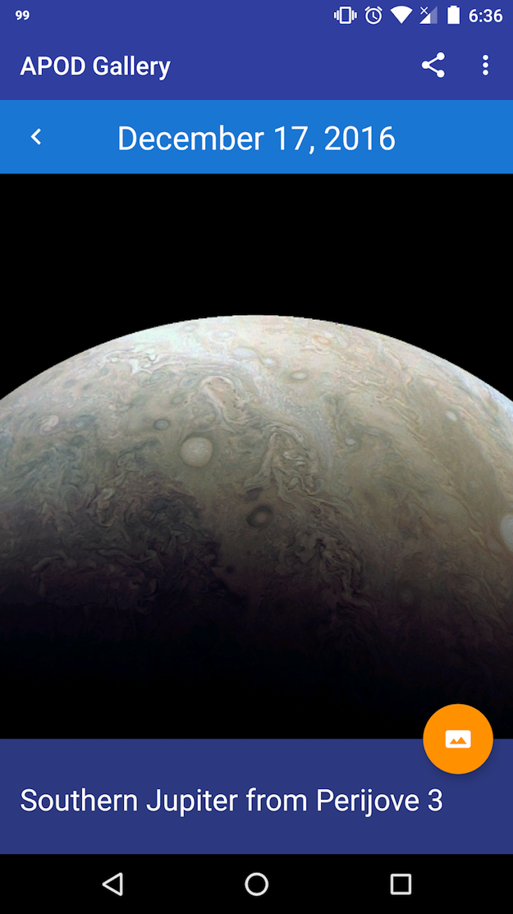

# APOD Gallery

[APOD Gallery](https://play.google.com/store/apps/details?id=ca.jeffrey.apodgallery&hl=en) is an Android app that lets you explore the cosmos with NASA's Astronomy Picture of the Day (APOD) service. NASA publishes a new image or video everyday related to astronomy for APOD, along with comprehensive documentation about the featured image. Using APOD Gallery you can learn more about the universe we live in through beautiful views of our outer space.

## Features
* Compatible with Android 4.1 and up
* Easily navigate to view featured picture of any day since 1995
* Swipe left and right to navigate between images
* Detailed background information of featured images
* Save images to external storage in HD or SD quality
* Set images as wallpaper
* Set automatic wallpaper changer
* Share images with others
* Export images to other apps
* View original content in browser
* View non-image content (featured videos, websites) featured on certain days

## Screenshots

|   |  |  |
|:---:|:---:|:---:|
